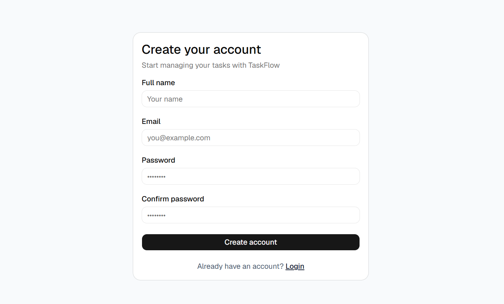
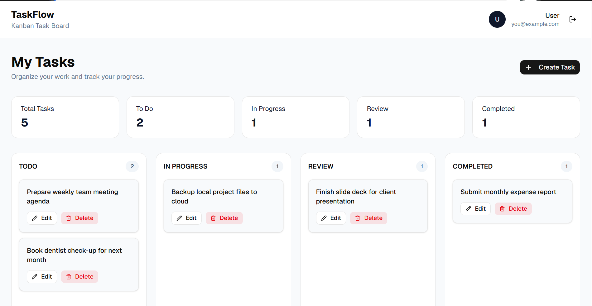
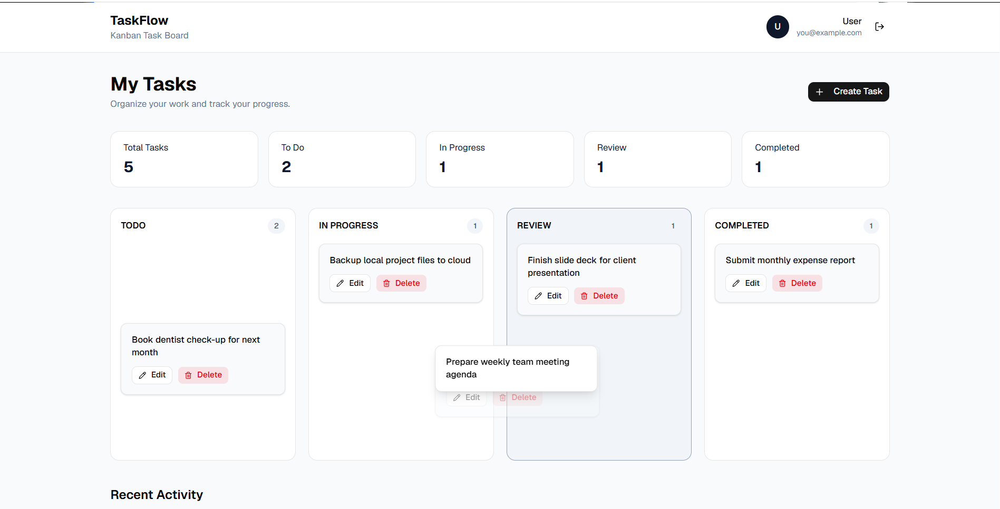

# TaskFlow — Kanban Task Board

TaskFlow is a Kanban-style task management application built with React and TypeScript. It allows users to create, manage, organize, and track tasks through different stages of a workflow.

## Features

- User registration and login
- Logout and authentication state management
- Protected dashboard route
- User-specific task management
- Create, read, update, and delete tasks
- Kanban board with four workflow stages:
  - TODO
  - IN PROGRESS
  - REVIEW
  - COMPLETED
- Drag-and-drop task movement between columns
- Persistent task and activity data using browser localStorage
- Dashboard task statistics
- Recent activity tracking
- User-specific activity history
- Form validation with Zod
- Responsive user interface
- Error handling
- Client-side routing with TanStack Router

## Tech Stack

| Technology | Purpose |
|------------|---------|
| React | UI development |
| TypeScript | Type-safe development |
| Vite | Development and build tooling |
| Zustand | Global state management |
| TanStack Router | Client-side routing |
| Tailwind CSS | Styling |
| shadcn/ui | UI components |
| React Hook Form | Form management |
| Zod | Form validation |
| dnd-kit | Drag-and-drop functionality |
| Lucide React | Icons |
| Bun | Package manager and runtime |

## Application Workflow

```text
Authentication
      ↓
   Dashboard
      ↓
   Kanban Board
      ↓
TODO → IN PROGRESS → REVIEW → COMPLETED
```

The root route `/` redirects users to the login page.

Authenticated users can access the dashboard, while unauthenticated users are redirected to the login page.

## Authentication

TaskFlow provides a basic authentication flow with:

- User registration
- User login
- Logout
- Authentication state persistence
- Protected dashboard route

Authentication state is managed using Zustand.

User information is stored in browser `localStorage` for this frontend-only implementation.

## Dashboard

The dashboard provides an overview of the user's tasks and recent activity.

### Dashboard Statistics

The dashboard displays:

- Total Tasks
- To Do
- In Progress
- Review
- Completed

These statistics are calculated from the tasks belonging to the currently authenticated user.

### Recent Activity

The dashboard displays recent task-related activities, including:

- Task creation
- Task updates
- Task completion
- Task deletion

## Task Management

TaskFlow supports complete CRUD operations for tasks.

### Create

Users can create a new task by entering a task title.

### Read

Tasks belonging to the authenticated user are displayed on the Kanban board.

### Update

Users can update task information and change the task status.

### Delete

Users can delete tasks from the dashboard.

## Kanban Board

The application uses a four-stage Kanban workflow:

```text
TODO → IN PROGRESS → REVIEW → COMPLETED
```

Tasks can be moved between columns using drag-and-drop.

The task status is updated in the application state and persisted to `localStorage`.

## Drag and Drop

Drag-and-drop functionality is implemented using `dnd-kit`.

Each task acts as a draggable element, while each Kanban column acts as a droppable area.

When a task is dropped into another column, its status is updated accordingly.

## User-Specific Data

Each task is associated with the ID of the user who created it.

```text
Task
├── id
├── userId
├── title
├── status
├── createdAt
└── updatedAt
```

The dashboard filters tasks using the currently authenticated user's `userId`.

This ensures that the application UI only displays tasks belonging to the logged-in user.

Activities are also associated with a `userId` and filtered accordingly.

## Activity Tracking

TaskFlow maintains an activity history for task-related actions.

Supported activity types include:

- `CREATED_TASK`
- `UPDATED_TASK`
- `COMPLETED_TASK`
- `DELETED_TASK`

Example activities:

```text
Created task "Complete project documentation"
Updated task "Prepare presentation"
Completed task "Finish dashboard"
Deleted task "Old task"
```

The most recent activities are displayed on the dashboard.

## Data Persistence

TaskFlow currently uses browser `localStorage` for data persistence.

The following data is stored locally:

- Registered users
- Current authenticated user
- Tasks
- Activity history

The application does not currently use a backend server or database.

## Project Structure

```text
taskflow-kanban/
│
├── public/
│
├── src/
│   ├── components/
│   │   └── ui/
│   │
│   ├── routes/
│   │   ├── dashboard.tsx
│   │   ├── index.tsx
│   │   ├── login.tsx
│   │   └── register.tsx
│   │
│   ├── schemas/
│   │   └── authSchema.ts
│   │
│   ├── stores/
│   │   ├── authStore.ts
│   │   └── taskStore.ts
│   │
│   ├── types/
│   │   ├── activity.ts
│   │   ├── auth.ts
│   │   └── task.ts
│   │
│   ├── main.tsx
│   └── index.css
│
├── .gitignore
├── components.json
├── package.json
├── tsconfig.json
├── vite.config.ts
└── README.md
```

## Getting Started

### Prerequisites

Make sure you have the following installed:

- Bun
- Git

### Clone the Repository

```bash
git clone https://github.com/ManwaniKhushi/taskflow-kanban.git
```

### Navigate to the Project

```bash
cd taskflow-kanban
```

### Install Dependencies

```bash
bun install
```

### Start the Development Server

```bash
bun run dev
```

The development server will provide a local URL, usually:

```text
http://localhost:5173
```

## Production Build

To create a production build:

```bash
bun run build
```

The production files will be generated in the `dist` directory.

## Validation and Error Handling

Forms use React Hook Form and Zod for validation.

The application handles cases such as:

- Invalid login credentials
- Duplicate registration email
- Empty task titles
- Invalid form input
- Missing tasks
- Unauthorized dashboard access

## Security Limitation

This project is intended as a **frontend project and learning/demo application**.

Authentication and persistence are currently handled entirely on the client side using browser `localStorage`.

Passwords are stored in `localStorage` in this implementation.

Therefore, this authentication system should **not be considered production-grade or secure for real-world applications**.

A production implementation should use:

- Backend authentication
- Password hashing
- Secure session or token management
- Database-backed persistence
- Server-side authorization
- Protected API endpoints
- HTTPS

## Future Improvements

Possible future improvements include:

- Backend API integration
- Database persistence
- Secure server-side authentication
- Password hashing
- User profile management
- Task priorities
- Due dates
- Task search
- Task filtering
- Task sorting
- Dedicated task editing interface
- Team collaboration
- Shared boards
- Notifications
- Production deployment
- Server-side authorization

## Screenshots

### Authentication



### Dashboard



### Kanban Board



## Author

**Khushi Manwani**

Student Developer | Web, Cloud & AI

GitHub: [ManwaniKhushi](https://github.com/ManwaniKhushi)
